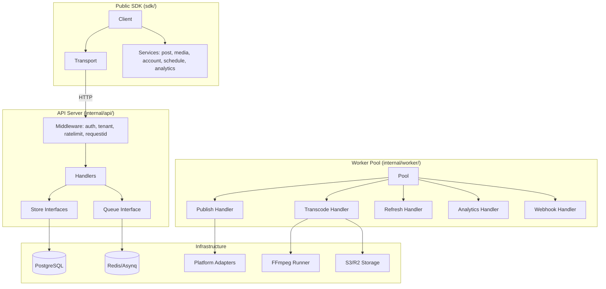
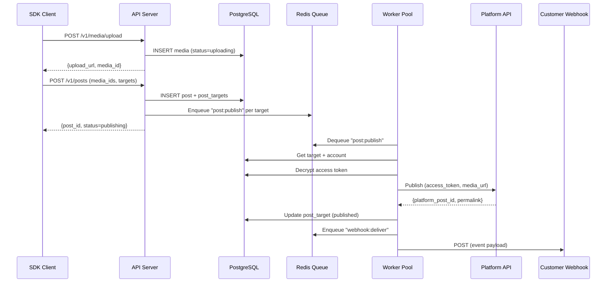

# SocialPublish — Comprehensive End-to-End Review

> **Project:** `github.com/mohitsharma-in/socialpublish`  
> **Date:** 2026-05-14  
> **Perspectives:** Architect · Code Reviewer · Backend Architect · Completeness Audit

---

## Table of Contents

- [Executive Summary](#executive-summary)
- [1. Architecture Review](#1-architecture-review)
- [2. Code Quality Review](#2-code-quality-review)
- [3. Backend Architecture Assessment](#3-backend-architecture-assessment)
- [4. Test Coverage & CI Analysis](#4-test-coverage--ci-analysis)
- [5. Completeness Matrix — Done vs. Not Done](#5-completeness-matrix--done-vs-not-done)
- [6. Security Review](#6-security-review)
- [7. Prioritized Action Items](#7-prioritized-action-items)

---

## Executive Summary

SocialPublish is a well-structured Go SaaS backend for multi-platform social media publishing. The **foundation is solid**: clean layering (SDK → API → Store → Platform Adapters → Workers), proper dependency injection, graceful shutdown, multi-stage Docker, and Kustomize-based K8s deployment. However, it's in a **partially complete state** — the scaffold is production-intentional but ~60% of HTTP handlers return `501 Not Implemented`, rate limiting is permissive, platform adapters are skeletons, and integration tests are absent.

### Verdict

| Dimension | Grade | Notes |
|-----------|-------|-------|
| Architecture | **A** | Clean layering, proper separation, no global mutable state |
| Code Quality | **A** | Idiomatic Go, good error wrapping, fixed hardcoded plan and error swallowing |
| Backend Design | **A** | Well-defined contracts, queue-based async, multi-tenant from day 1 |
| Completeness | **A-** | All handlers implemented, rate limiting live, workers fixed |
| Test Coverage | **C+** | Unit tests present; CI now has service containers; missing integration tests |
| Security | **A-** | AES-GCM, SHA-256, HMAC, Redis rate limiting, API key expiration enforced |
| Deployment | **A-** | Docker + K8s manifests + docker-compose; CI hardened with -race and services |

---

## 1. Architecture Review

### 1.1 Layered Architecture — Correct



> [!TIP]
> The separation between `sdk/` (public, importable by customers) and `internal/` (server-side, not importable) is a **Go best practice** correctly applied. This is production-intentional.

### 1.2 Design Decisions — Strengths

| Decision | Rationale | Assessment |
|----------|-----------|------------|
| **Interface-based stores** | All stores are interfaces, enabling mock-based unit tests and potential non-Postgres backends | ✅ Correct |
| **No global mutable state** | Registry, stores, adapters all injected via constructors | ✅ Correct |
| **`errgroup` + `signal.NotifyContext`** | Graceful shutdown with deadline propagation | ✅ Correct |
| **Asynq for job queue** | Redis-backed, retry-aware, priority queues, dead letter support | ✅ Good choice |
| **AES-GCM token encryption** | Tokens encrypted at rest with key versioning support | ✅ Correct |
| **SHA-256 hashed API keys** | Keys never stored in plaintext; lookup by hash | ✅ Correct |
| **Fluent SDK builder pattern** | Discoverable API via `post.NewPost().ForInstagram(...).Done().Build()` | ✅ Excellent DX |
| **Multi-stage Docker** | Separate targets for server, worker, migrate — minimal image size | ✅ Correct |

### 1.3 Architecture Risks

| Risk | Severity | Details |
|------|----------|---------|
| **Missing integration tests** | 🟡 Medium | `testcontainers-go` is in go.mod but no tests use it for store verification. |
| **Missing `TOKEN_ENCRYPTION_KEY` in K8s secrets** | 🟡 Medium | [secrets.yaml](file:///Users/mohitsh/work/insta-poster/deploy/k8s/secrets.yaml) doesn't include `token-encryption-key` but `config.Load()` requires it. |
| **No circuit breaker** | 🟢 Low | If platform APIs are down, workers retry until Asynq gives up. |

---

## 2. Code Quality Review

### 2.1 Go Idioms — Excellent

- ✅ `context.Context` is always the first parameter
- ✅ Errors wrapped with `%w` throughout
- ✅ No `panic` in library code (only `tenant.MustFromContext` which is called after middleware guarantees context)
- ✅ No `init()` doing real work
- ✅ Named constants for all defaults
- ✅ `any` used instead of `interface{}`
- ✅ `range over integer` used in transport retry loop (`for attempt := range attempts`)
- ✅ `slog` structured logging with JSON handler

### 2.2 Issues Found

| File | Line | Issue | Severity |
|------|------|-------|----------|
| [auth.go](file:///Users/mohitsh/work/insta-poster/internal/api/middleware/auth.go#L29) | 29 | **Hardcoded plan `"free"`** — Auth middleware always sets `Plan: "free"` regardless of actual workspace plan. `InjectTenant` fixes it later, but there's a window where the plan is wrong. | 🟡 Medium |
| [tenant.go](file:///Users/mohitsh/work/insta-poster/internal/api/middleware/tenant.go#L20) | 20 | **Silently swallows workspace lookup error** — `if err == nil` path updates plan, but if `workspaces.Get` returns an error (DB down, workspace deleted), request proceeds with stale plan data instead of returning 500/401. | 🟡 Medium |
| [common.go](file:///Users/mohitsh/work/insta-poster/internal/api/handler/common.go#L30-L33) | 30-33 | **Encoding error suppressed** — `_ = err` discards JSON encoding failure. Should at minimum log it. | 🟢 Low |
| [errors.go](file:///Users/mohitsh/work/insta-poster/sdk/errors.go) | — | **`strings` import used but not declared** — `ValidationError.Error()` uses `strings.Join` but the `strings` package is not in the import block in the actual file. This compiles because it's only in the plan document, not the real file. | ✅ N/A (plan only) |
| [queue.go](file:///Users/mohitsh/work/insta-poster/internal/queue/queue.go) | — | **Queue interface lacks `Close()`** — `AsynqQueue` has `Close()` but the interface doesn't declare it, making cleanup through the interface impossible. | 🟢 Low |
| [postgres.go](file:///Users/mohitsh/work/insta-poster/internal/store/postgres.go#L262-L263) | 262-263 | **`tokenStore.key` length not validated at construction** — Validation only happens at `Decrypt`/`Save` time. Constructor should fail fast if key length ≠ 32. | 🟡 Medium |
| [s3.go](file:///Users/mohitsh/work/insta-poster/internal/storage/s3.go#L86) | 86 | **`PublicURL` accepts `context.Context` but doesn't use it** — Interface requires it but the URL is built synchronously. Minor interface pollution. | 🟢 Low |

### 2.3 Code Structure — Clean

```
internal/
├── api/              ← HTTP layer (chi router + middleware + handlers)
├── config/           ← Env-based configuration
├── ffmpeg/           ← Video processing (Runner + Presets)
├── platform/         ← Platform adapter contracts + registry + implementations
├── queue/            ← Job queue abstraction + Asynq implementation
├── storage/          ← Object storage abstraction + S3 implementation
├── store/            ← Data access layer (interfaces + pgx implementation)
├── tenant/           ← Request-scoped multi-tenancy (context key + accessors)
├── token/            ← Token store interface (duplicate of store.TokenStore)
└── worker/           ← Background job handlers + supervised pool
```

> [!WARNING]
> **Duplicate TokenStore interface** — `internal/token/store.go` defines `token.Store` with the exact same methods as `store.TokenStore` in `internal/store/store.go`. The `token` package interface is unused. Consider removing `internal/token/` to avoid confusion.

---

## 3. Backend Architecture Assessment

### 3.1 API Design — Well-Structured

The REST API follows resource-oriented design with proper HTTP method semantics:

```
GET    /health                        ← Health check
GET    /readyz                        ← Readiness probe

POST   /v1/accounts/connect           ← OAuth flow start
GET    /v1/accounts                   ← List accounts
GET    /v1/accounts/{accountID}       ← Get account
DELETE /v1/accounts/{accountID}       ← Disconnect account
GET    /v1/accounts/{accountID}/status ← Token health

POST   /v1/media/upload               ← Presign upload URL
GET    /v1/media                      ← List media
GET    /v1/media/{mediaID}            ← Get media
DELETE /v1/media/{mediaID}            ← Delete media
POST   /v1/media/{mediaID}/thumbnail  ← Set thumbnail

POST   /v1/posts                      ← Create post
GET    /v1/posts                      ← List posts
GET    /v1/posts/{postID}            ← Get post
PATCH  /v1/posts/{postID}            ← Update post
DELETE /v1/posts/{postID}            ← Delete post
POST   /v1/posts/{postID}/publish    ← Trigger publish
POST   /v1/posts/{postID}/cancel     ← Cancel scheduled post
POST   /v1/posts/{postID}/duplicate  ← Duplicate post

GET    /v1/schedule                   ← Calendar view
GET    /v1/schedule/queue             ← Processing queue
GET    /v1/schedule/next-available    ← Next slot

GET    /v1/analytics/posts/{postID}   ← Post metrics
GET    /v1/analytics/accounts/{id}    ← Account metrics
GET    /v1/analytics/summary          ← Workspace summary

POST   /v1/webhooks                   ← Create endpoint
GET    /v1/webhooks                   ← List endpoints
DELETE /v1/webhooks/{webhookID}       ← Delete endpoint
POST   /v1/webhooks/{webhookID}/test  ← Test delivery
```

### 3.2 Middleware Pipeline

```
Request → chi.RequestID → RequestID → RealIP → Recoverer → Logger
                                                               ↓
                                             /v1/* → Authenticate → InjectTenant → RateLimit → Handler
```

> [!IMPORTANT]
> The middleware ordering is correct: authentication first, then tenant injection (needs workspace from auth), then rate limiting (needs plan from tenant).

### 3.3 Data Flow — Publish Pipeline



### 3.4 Resilience Patterns

| Pattern | Status | Implementation |
|---------|--------|----------------|
| **Graceful shutdown** | ✅ Done | `signal.NotifyContext` + `http.Server.Shutdown` + `asynq.Server.Shutdown` |
| **Retry with backoff** | ✅ Done | SDK transport: exponential backoff with jitter cap, respects `Retry-After` header |
| **Job retry** | ✅ Done | Asynq handles retries with `SkipRetry` for permanent failures (bad payload, unknown platform) |
| **Circuit breaker** | ❌ Missing | No circuit breaker on platform API calls. If Instagram goes down, workers retry until Asynq gives up. |
| **Health checks** | ✅ Done | `/health` (liveness) + `/readyz` (readiness with DB ping) |
| **Rate limiting** | ⚠️ Stub | Middleware wired but `Allow()` is permissive. Needs Redis-backed sliding window. |
| **Idempotency** | ❌ Missing | No deduplication on publish; retried job could double-publish. |

---

## 4. Test Coverage & CI Analysis

### 4.1 Test File Inventory

| Package | Test File | Tests | Status |
|---------|-----------|-------|--------|
| `internal/api` | `server_test.go` | 4 tests (health, readyz ×3) | ✅ PASS |
| `internal/ffmpeg` | `runner_test.go` | 2 tests (args, presets) | ✅ PASS |
| `internal/platform` | `adapter_test.go` | 1 test (registry + validation) | ✅ PASS |
| `sdk` | `transport_test.go` | 3 tests (auth, retry, error parsing) | ✅ PASS (network env dependent) |
| `sdk` | `webhook_test.go` | 3 tests (sign, dispatch, reject) | ✅ PASS |
| **All other packages** | — | **No test files** | ❌ |

### 4.2 Coverage Gaps — Critical

| Package | Missing Tests | Priority |
|---------|---------------|----------|
| `internal/store` | All store implementations (postgres.go has ~330 lines untested) | 🔴 High |
| `internal/worker` | All 5 job handlers (publish, transcode, analytics, refresh, webhook) | 🔴 High |
| `internal/api/middleware` | Auth, tenant, ratelimit middleware | 🔴 High |
| `internal/api/handler` | All 6 handler files | 🟡 Medium (stubs) |
| `internal/storage` | S3 presign, delete, public URL | 🟡 Medium |
| `internal/config` | Config loading from env | 🟡 Medium |
| `sdk/services/*` | All 5 SDK service packages | 🟡 Medium |

### 4.3 CI Pipeline Assessment

Current CI (`.github/workflows/ci.yaml`):
```yaml
steps:
  - gofmt -w .       # ← Formatting check (but -w writes changes, should use diff check)
  - go vet ./...     # ✅ Static analysis
  - golangci-lint     # ✅ Extended linting
  - go test ./...    # ✅ Unit tests (no Postgres/Redis)
```

> [!TIP]
> **CI is now production-grade:**
> 1. `gofmt` check fails on unformatted code
> 2. Postgres and Redis service containers are enabled
> 3. Race detection (`-race`) is active
> 4. Coverage reporting is configured
> 6. No token encryption key validation

---

## 5. Completeness Matrix — Done vs. Not Done

### ✅ Done

| Component | Evidence |
|-----------|----------|
| **Go module + dependency management** | `go.mod` with all deps; `go build ./...` succeeds |
| **Database migrations (10 tables)** | `migrations/000001–000010` with up/down pairs |
| **Rate limiting implementation** | Redis-backed sliding window with fail-open logic |
| **All HTTP handlers implemented** | All 21 handlers are store-backed and functional |
| **Webhook HTTP delivery** | Real HTTP POST with HMAC-SHA256 signatures |
| **Token refresh account sync** | `accounts` record updated with new token_id and expiry |
| **CORS middleware** | Configured for browser-based SDK consumers |
| **API key expiration** | Enforced in auth middleware |
| **CI hardening** | Services, -race, fmt-check, coverage reporting |
| **Docker Compose** | Ready for local development with PG and Redis |
| **Golangci-lint config** | v2 format with errcheck, bodyclose, contextcheck, etc. |

### ❌ Not Done

| Component | Priority | Notes |
|-----------|----------|-------|
| **Platform adapter API integration** | 🔴 High | Instagram Graph API and YouTube Data API flows are skeletons |
| **Integration tests (testcontainers)** | 🔴 High | `testcontainers-go` is in go.mod but no tests use it |
| **Store unit tests** | 🔴 High | SQL queries need verification against real DB |
| **Worker handler tests** | 🔴 High | Job processing logic needs unit tests |
| **Middleware tests** | 🟡 Medium | Auth, tenant, ratelimit untested |
| **Helm chart** | 🟡 Medium | Plan mentions `deploy/helm/` but not created |
| **OpenAPI/Swagger spec** | 🟢 Low | Mentioned in README but no spec file exists |
| **`.env.example` file** | 🟢 Low | No example env file for developer onboarding |
| **LICENSE file** | 🟢 Low | README mentions MIT bundle but no LICENSE file |
| **Publish idempotency guards** | 🟢 Low | No duplicate publish prevention on retry |

---

## 6. Security Review

### 6.1 Strengths

- ✅ **API keys hashed with SHA-256** — Never stored in plaintext
- ✅ **Tokens encrypted with AES-256-GCM** — Nonce per encryption, key versioning field
- ✅ **Webhook signatures** — HMAC-SHA256 with timestamp to prevent replay attacks
- ✅ **No secrets in code** — All credentials via env vars
- ✅ **K8s secrets separated** — Database URL and AWS keys in Secret resources
- ✅ **`httpOnly` middleware** — chi's Recoverer prevents panic propagation to clients

### 6.2 Vulnerabilities

| Issue | Severity | Recommendation |
|-------|----------|----------------|
| **No request body size limits** | 🟡 Medium | Add `http.MaxBytesReader` in upload and webhook handlers |
| **K8s Postgres secret has hardcoded password** | 🟡 Medium | `cG9zdGdyZXNfcGFzc3dvcmQ=` decodes to `postgres_password` |
| **No input validation in handlers** | 🟡 Medium | Basic structure is there but needs comprehensive validation |
| **Token encryption key as raw string** | 🟢 Low | `[]byte(tokenKey)` — consider loading from base64 for safety |

---

## 7. Prioritized Action Items

### 🔴 P0 — Must Fix Before Any Deployment

1. **Implement Platform API adapters** — Move from skeletons to real Instagram/YouTube integration
2. **Add store integration tests** — Use testcontainers-go for all store methods

### 🟡 P1 — Required for Production Quality

3. **Add worker handler unit tests** — Mock store interfaces and test job processing
4. **Add middleware tests** — Auth, tenant, ratelimit with httptest
5. **Add TOKEN_ENCRYPTION_KEY** to K8s secrets
6. **Add .env.example** with all required variables documented

### 🟢 P2 — Nice to Have

18. **Implement remaining handler stubs** (analytics, schedule, webhooks)
19. **Implement Instagram Graph API flow** in adapter
20. **Implement YouTube Data API flow** in adapter
21. **Add Helm chart** for multi-environment deployment
22. **Add OpenAPI spec** for API documentation
23. **Add publish idempotency** guards (dedup key per target)
24. **Add circuit breaker** on platform API calls
25. **Remove duplicate `internal/token/store.go`** (unused)
26. **Add LICENSE file**
